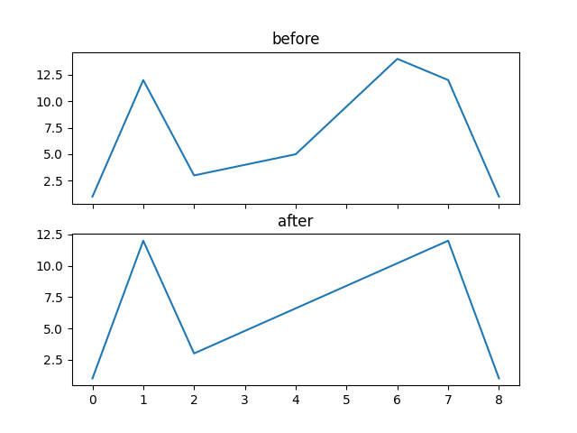

# lang-simplification

Lang simplification algorithm created with python. More information about the algorithm can be found [here](http://psimpl.sourceforge.net/lang.html).

## Usage with Docker

### Building

1. `docker image build --tag lang-simplification .`

2. Run the algorithm with `docker container run -it --rm lang-simplification <input> <tolerance> <look_ahead>`

### Pulling from docker hub

1. `docker pull klemmari/lang-simplification:latest`

2. Run the algorithm with `docker container run -it --rm klemmari/lang-simplification <input> <tolerance> <look_ahead>`

## Usage without Docker

1. Create a virtual environment.

2. Run `pip install -r requirements.txt`

3. `python lang_simplification.py <input> <tolerance> <look_ahead>`

## Example input

Input data is an array of d dimensional points followed by the tolerance and look ahead parameters:

* `python lang_simplification.py "[[0, 1], [1, 12], [2, 3], [4, 5], [6, 14], [7, 12], [8, 1]]" 2 3`

*  `python lang_simplification.py "[[0, 1, 2, 3, 4], [1, 12, 2, 3, 4], [2, 3, 2, 3, 4], [4, 5, 2, 3, 4], [6, 14, 2, 3, 4], [7, 12, 2, 3, 4], [8, 1, 2, 3, 4]]" 2 3`

## Example visualization

Example visualization of the input `"[[0, 1], [1, 12], [2, 3], [4, 5], [6, 14], [7, 12], [8, 1]]" 2 3`

